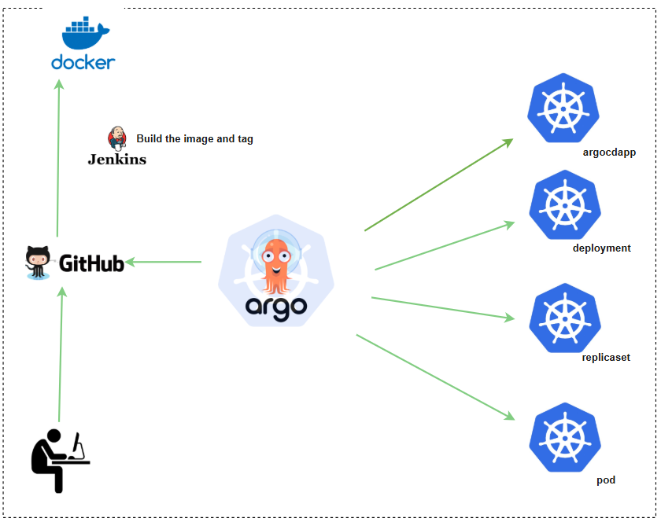

# CI/CD Automation Using ArgoCD, Docker, Helm & Kubernetes
## This project demonstrates a complete CI/CD pipeline built using:
 - Docker for containerization
 - Helm for packaging Kubernetes manifests
 - ArgoCD for GitOps-based continuous delivery
 - Kubernetes for application deployment

## Architecture

## Technologies Used

| Tool             | Purpose                                                                |
| ----------------- | ------------------------------------------------------------------ |
| GitHub |  CI Pipeline|
| Helm | Package & version Kubernetes manifests |
| ArgoCD	 | Declarative GitOps deployment |
| Kubernetes | Run application workloads |
